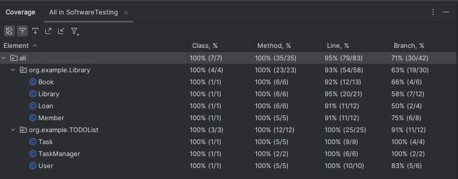
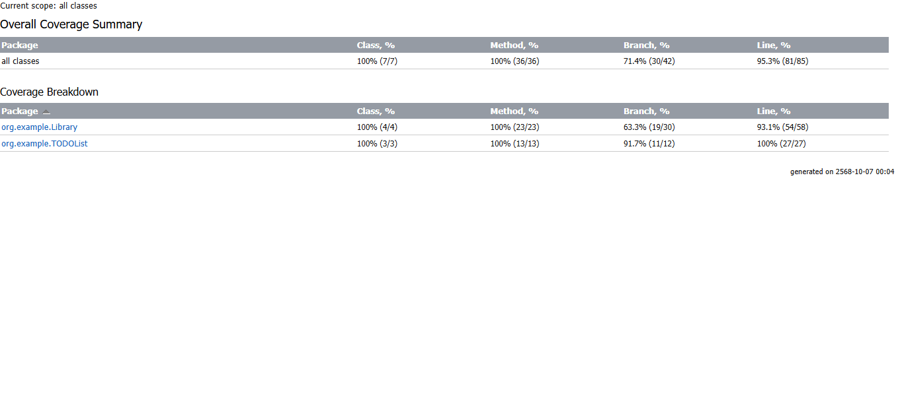
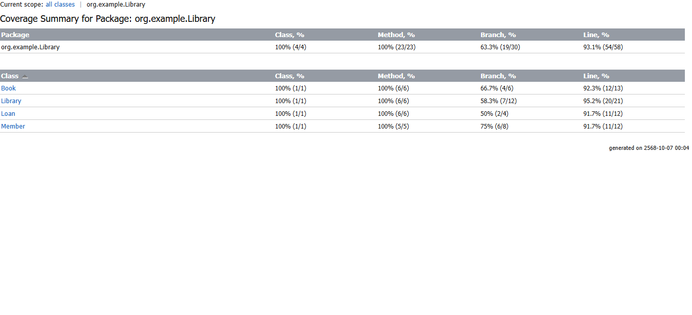
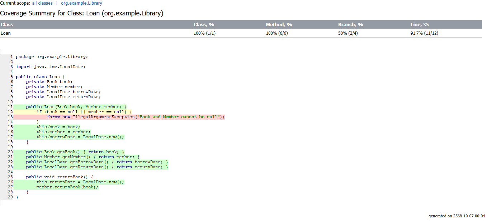
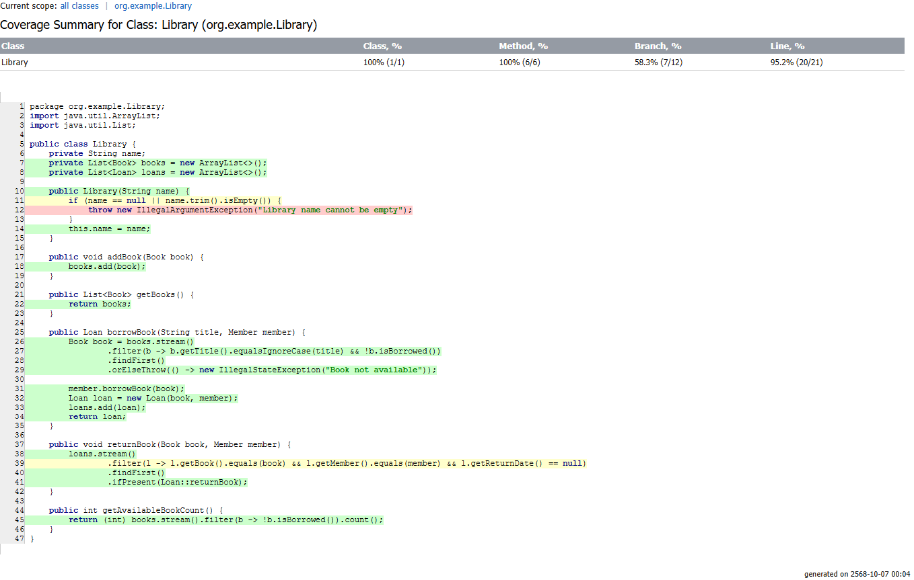
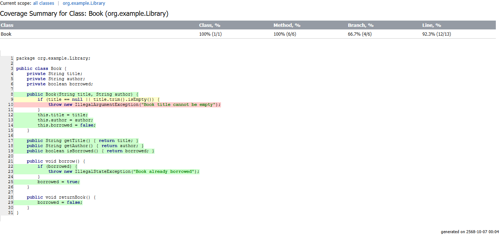
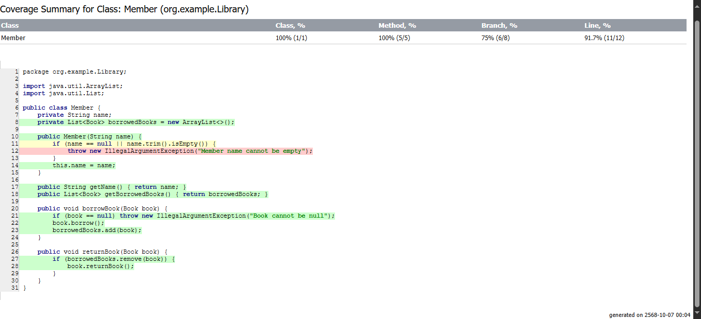
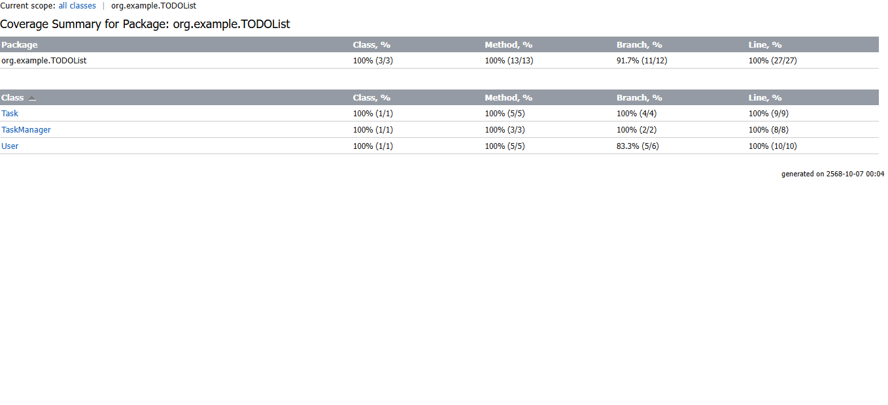
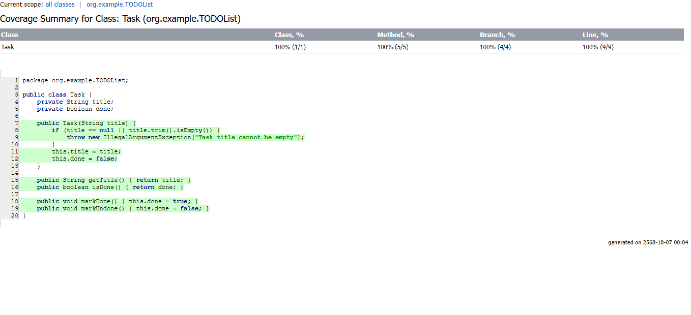
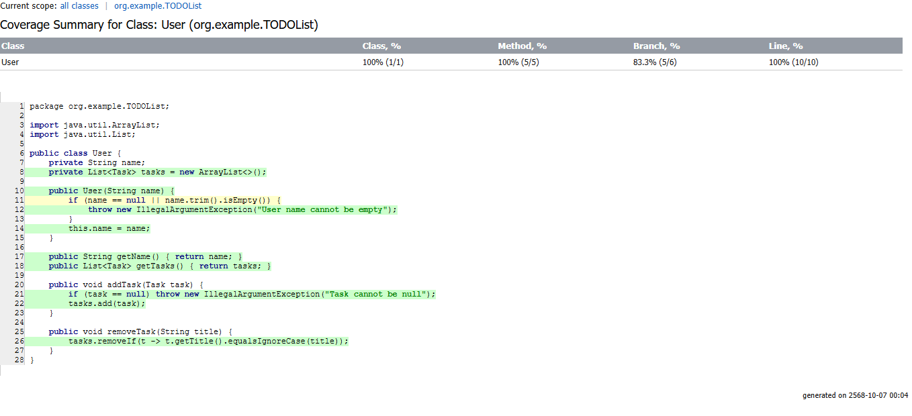

# Software Testing and Verification - 01418474

---

### รายละเอียดโปรเจค
โปรเจคนี้ทำเกี่ยวกับการทดสอบโปรแกรม Java ทั้งหมดด้วยกัน 2 โปรแกรมโดยใช้เครื่องมือในการทดสอบ Framework อย่าง
Junit4 มาใช้ในการตรวจสอบหาข้อผิดพลาดที่เกิดขึ้นในตัวโปรแกรมและได้จัดทำเอกสารรายงาน Test Scenario ขึ้นมาเพื่อประกอบการทดสอบในครั้งนี้

ไฟล์รายงาน [Test Scenario.pdf](./report/Test%20Scenario%20(Final%20Project).pdf)

---

### สมาชิกในกลุ่ม
1. นาย วรินทร์ สายปัญญา รหัสนิสิต 6630250435
2. นาย ปุณณภพ มีฤทธิ์ รหัสนิสิต 6630250591

--- 

### ภาพตัวอย่างการทดสอบ

แสดงค่า Coverage ของตัวโปรแกรมที่รัน

รายงานค่า Coverage

#### โปรแกรม Library

#### โปรแกรม Todo List

